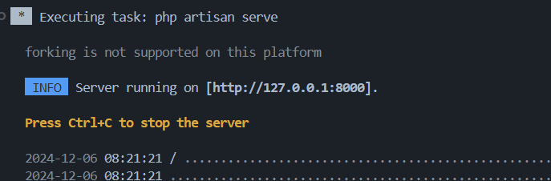

## Goker

Goker is an website application, TBA, On Development, docs will be updated.


## Installation

### Setup composer & .env files

```bash
composer install
php artisan key:generate
php artisan migrate

php artisan serve # run laravel application
```

### Setup Vite

Add another command prompt at terminal and run

```bash
npm install && npm run dev
```

## Running The Application

### Run the Laravel

On first terminal, run laravel by doing

```bash
php artisan serve
```

### Run the Vite

On second terminal, run vite by doing

```bash
npm run dev
```

### Go to URL

On your terminal there will be an IP Address that contains Goker Website Application



## Database Configuration

### .env file

Set .env database section to

```
DB_CONNECTION=mysql
DB_HOST=127.0.0.1
DB_PORT=3306
DB_DATABASE=goker
DB_USERNAME=root
DB_PASSWORD=
```

After that, we can turn on XAMPP.

### Migrate Database && Seed

```bash
php artisan migrate:fresh --seed
```

## About Goker

Built brick by brick using our simply hands and behold,
- Shean Finnegan
- Matthew Raditya A. P.
- Cecilia Oktaviana
- Irene Setievi
- Arjuna Andio

### Libraries Used

- Laravel 11
- TBA
- Will be updated later